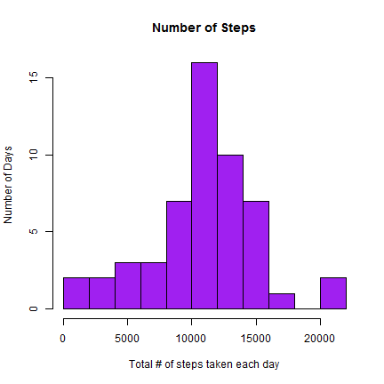
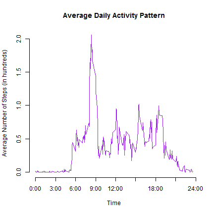
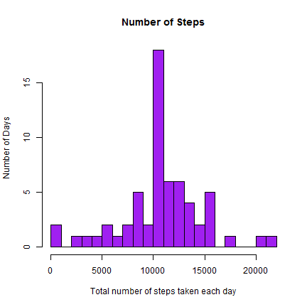
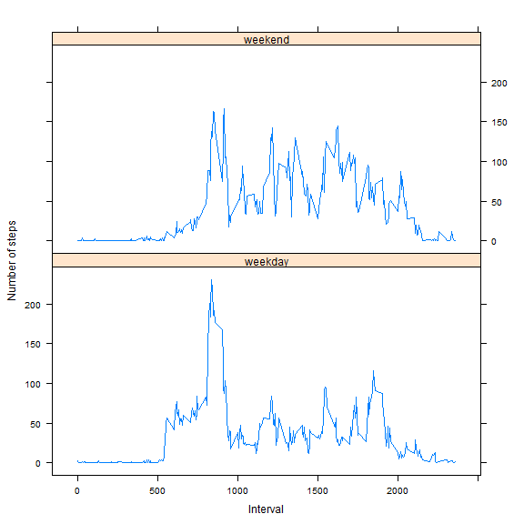

# Reproducible Research: Peer Assessment 1


## Loading and preprocessing the data (using subdirectory data)

```r
datacsv <- read.csv("./data/activity.csv", header = T)

# create a subset with NA filtered out
dataNaOmit <- subset(datacsv, is.na(datacsv$steps) == F)
```

## calculating the mean  - median total number of steps taken per day?

### 1. Make a histogram of the total number of steps per each day

calculating the total number of steps taken each day using ddply function


```r
library(plyr)
PerDayTotal <- ddply(dataNaOmit, .(date), summarise, sumsteps=sum(steps))
```

creating the plot


```r
hist(PerDayTotal$sumsteps, breaks = 10, main="Number of Steps", 
     xlab="Total # of steps taken each day", ylab = "Number of Days", col="purple")
```

 

### 2. Calculating - reporting the mean and median total number of steps taken per day

mean

```r
mean(PerDayTotal$sumsteps)
```

```
## [1] 10766.19
```

median

```r
median(PerDayTotal$sumsteps)
```

```
## [1] 10765
```

## What is the average daily activity pattern?

### 1. Make a time series plot (i.e. type = "l") of the 5-minute interval (x-axis) and the average number of steps (y-axis)

calcluating the average number of steps taken in each 5-minite intervals

```r
PerIntervAver <- ddply(dataNaOmit, .(interval), summarise, meansteps=mean(steps))
```

creating the plot


```r
plot(PerIntervAver$interval, PerIntervAver$meansteps / 100 ,axes = F, type="l", col="purple", xlab="Time", ylab="Average Number of Steps (in hundreds)",
     main="Average Daily Activity Pattern")
axis(1,at=c(0,300,600,900,1200,1500,1800,2100,2400), label = c("0:00","3:00","6:00","9:00","12:00","15:00","18:00","21:00","24:00"))
axis(2)
```

 

### 2. Which 5-minute interval, contains the maximum number of steps?


```r
PerIntervAver[which.max(PerIntervAver$meansteps),]
```

```
##     interval meansteps
## 104      835  206.1698
```

So it is the interval from 8:35 to 8:40

## Imputing missing values

### 1. Calculate and report the total number of missing (NA) values in the dataset

```r
sum(is.na(datacsv$steps))
```

```
## [1] 2304
```

### 2.Devise a strategy for filling in all of the missing values in the dataset. 

I will fill the NA value with average value for that 5-min interval

### 3. Create a new dataset equivalent with the original one, but with the missing data filled in.

which insinde the loop is returning the position of the respective steps interval

```r
datacopy <- datacsv

for (i in 1:nrow(datacopy)){
    if (is.na(datacopy$steps[i])){
        datacopy$steps[i] <- PerIntervAver$meansteps[which(datacopy$interval[i] == PerIntervAver$interval)  ] }
}

datacopy <- arrange(datacopy, interval)
```

### 3. Make a histogram of the total number of steps per each day, calculating  the mean and median total number of steps per day. 

calculating the total number of steps taken each day

```r
PerDayCopyTotal <- ddply(datacopy, .(date), summarise, sumsteps=sum(steps))
```

creating the plot

```r
hist(PerDayCopyTotal$sumsteps, breaks = 20, main="Number of Steps", xlab="Total number of steps taken each day", ylab = "Number of Days", col="purple")
```

 

Calculate and report the mean and median total number of steps taken per day on the revised dataset

```r
mean(PerDayCopyTotal$sumsteps)
```

```
## [1] 10766.19
```


```r
median(PerDayCopyTotal$sumsteps)
```

```
## [1] 10766.19
```

test does these values differ from thoes in the first part
PerDaytotal the first set, PerDayCopyTotal the revised set

```r
abs(mean(PerDayCopyTotal$sumsteps)- median(PerDayCopyTotal$sumsteps)) 
```

```
## [1] 0
```

```r
abs(median(PerDayTotal$sumsteps)- median(PerDayCopyTotal$sumsteps))/median(PerDayTotal$sumsteps)
```

```
## [1] 0.0001104207
```

so the mean didn't change, the median slightly changed about 0.00011% of the original value.

test how total steps taken per day differ


```r
totalDiffSteps <- sum(datacopy$steps) - sum(dataNaOmit$steps)
totalDiffSteps
```

```
## [1] 86129.51
```

Impute the dataset cause the estimation on total steps per day to increase

## Are there differences in activity patterns between weekdays and weekends?

### 1. Create a new factor variable in the dataset ("weekday" and "weekend")


```r
Sys.setlocale("LC_TIME", "English") 
```

```
## [1] "English_United States.1252"
```

```r
datacopy$weekdays <- weekdays(as.Date(datacopy$date))
datacopy$weekdays <- ifelse(datacopy$weekdays %in% c("Saturday", "Sunday"),"weekend", "weekday")
```

### 2.Panel plot containing a time series (i.e. type = "l") of the 5-minute interval (x-axis) and the average number of steps taken (Y-axis) 

calcluating the average for each interval

```r
averdata <- ddply(datacopy, .(interval, weekdays), summarise, meansteps=mean(steps))
```

creating the xyplot


```r
library(lattice)
xyplot(meansteps ~ interval | weekdays, data = averdata, layout = c(1, 2), type="l", xlab = "Interval", ylab = "Number of steps")
```

 

